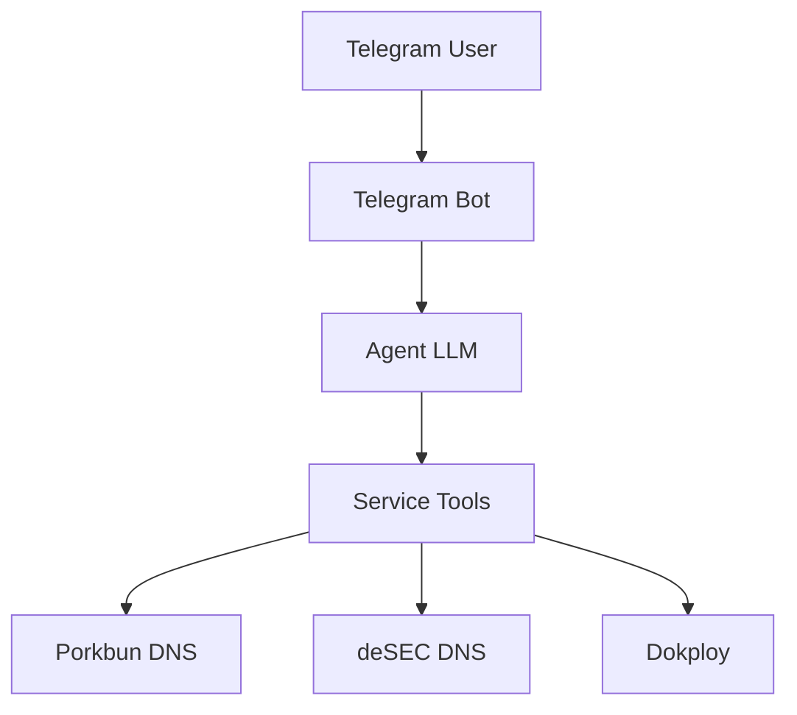

# Kerdus

A lightweight, single-user AI infrastructure assistant accessible through Telegram.

Manage DNS and deployments — all via natural language.

## Architecture



## Stack

- Python 3.12+
- FastAPI + uvicorn (long polling, no inbound webhook)
- python-telegram-bot
- OpenAI-compatible LLM API
- pydantic-settings + httpx
- jinja2 (tool-result rendering)
- loguru (logging with secret redaction)

## Prerequisites

- Python 3.12+
- [uv](https://docs.astral.sh/uv/) package manager
- A Telegram bot token (from @BotFather)
- An LLM API key (OpenAI-compatible)
- API credentials for the services you want to manage

## Setup

```bash
git clone https://github.com/yourname/kerdus.git
cd kerdus
cp .env.example .env
# edit .env with your secrets
uv sync
```

## Configuration

There are two layers:

### `config.json` (non-secret tunables)

```json
{
  "telegram": {
    "allowed_user_id": 123456789
  },
  "agent": {
    "max_iterations": 5
  }
}
```

`AppConfig` rejects unknown keys (`extra="forbid"`). Agent options:

| field                    | default | range         | notes                              |
|--------------------------|---------|---------------|------------------------------------|
| `max_iterations`         | 5       | 1–20          | applied on hot reload              |
| `processing_hint`        | false   | —             | show `…` while thinking            |
| `max_tool_result_chars`  | 4000    | 1–100000      | truncate large tool output         |
| `max_llm_retries`        | 2       | 0–10          | LLM call retries                   |
| `llm_retry_base_seconds` | 1.0     | 0.1–60        | retry backoff base                 |

`telegram.allowed_user_id` can be overridden at runtime by `TELEGRAM_ALLOWED_USER_ID`.

### `.env` (secrets, never commit)

```ini
# Telegram
TELEGRAM_BOT_TOKEN=
TELEGRAM_ALLOWED_USER_ID=

# LLM
LLM_API_KEY=
LLM_MODEL=gpt-4o
LLM_BASE_URL=

# Porkbun DNS
PORKBUN_ENABLED=true
PORKBUN_API_KEY=
PORKBUN_SECRET_KEY=

# deSEC DNS
DESEC_ENABLED=true
DESEC_TOKEN=

# Dokploy
DOKPLOY_ENABLED=true
DOKPLOY_URL=
DOKPLOY_API_KEY=
# Show environment variables / secrets in Dokploy tool results (default: hidden)
DOKPLOY_SHOW_SECRET=false

# General
TZ=UTC
LOG_LEVEL=INFO
```

Each service has an `*_ENABLED` toggle in `.env`; disabling a service removes its
tools from the agent.

## Run

```bash
uv run uvicorn app.main:app --host 0.0.0.0 --port 8000
```

The bot connects to Telegram by **long polling** — no inbound port or webhook
URL is required.

## Docker

```bash
docker build -t kerdus .
docker run -p 8000:8000 --env-file .env kerdus
```

Mount `config.json` to hot-edit from the host:

```bash
docker run -p 8000:8000 --env-file .env \
  -v $(pwd)/config.json:/app/config.json \
  kerdus
```

## Dynamic configuration

`config.json` is hot-reloaded two ways:

1. **Polling** — the file is checked for changes every 5 seconds and applied if
   it changed.
2. **Manual trigger** — `POST /config/reload` reloads the file on demand.

Changes to `telegram.allowed_user_id`, `agent.processing_hint`, and
`agent.max_iterations` take effect immediately. Credentials and service toggles
are read from `.env` at startup and require a restart.

## Tools

| Area        | Tool                                                             |
|-------------|------------------------------------------------------------------|
| Porkbun     | list domains, retrieve/create/update/delete records              |
| deSEC       | list domains, retrieve/create/update/delete records (RRsets)     |
| Dokploy     | list projects; inspect project/application/compose/database      |
| Dokploy     | add/delete/test a Telegram notification                          |

Dokploy detail results hide environment variables and secrets unless
`DOKPLOY_SHOW_SECRET=true`.

## Usage

Message your Telegram bot:

- "List my domains."
- "Show DNS records for example.com."
- "Add an A record for api.example.com pointing to 1.2.3.4."
- "Delete the CNAME record for www.example.com."
- "List my Dokploy projects."
- "Add a Telegram notification in Dokploy."

## Safety

The agent has **no** shell, SSH, filesystem, or arbitrary code execution capability.

All actions go through registered service tools with explicit schemas. Only the
configured `allowed_user_id` can interact with the bot, and secrets are redacted
from logs and tool results.

## Endpoints

- `GET /health` — liveness check
- `GET /ready` — readiness, Telegram status, and LLM reachability probe
- `POST /config/reload` — force config reload