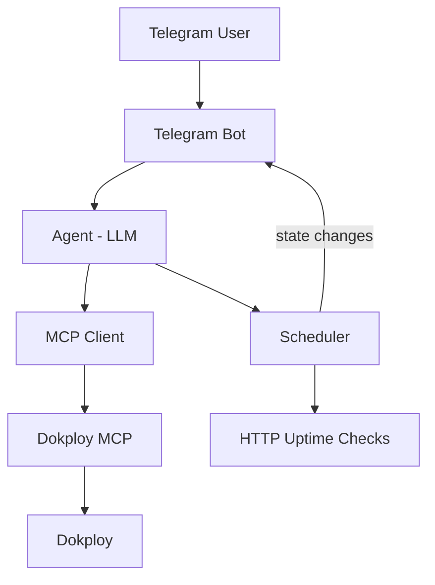

# Kerdus

A lightweight, single-user AI operations agent accessible through Telegram.

## Architecture



## Stack

- Python 3.12+
- FastAPI + uvicorn
- python-telegram-bot
- MCP Python SDK
- OpenAI-compatible LLM API
- APScheduler
- httpx (uptime checks)
- loguru (logging)

## Prerequisites

- Python 3.12+
- [uv](https://docs.astral.sh/uv/) package manager
- Node.js + npx (for MCP server processes, e.g. `dokploy-mcp`)
- A Telegram bot token (from @BotFather)
- An LLM API key (OpenAI-compatible)
- Dokploy MCP server (or another MCP server to connect to)

## Setup

```bash
git clone https://github.com/yourname/kerdus.git
cd kerdus
cp .env.example .env
# edit .env with your secrets
uv sync
```

## Configuration

`config.json` (static):

```json
{
  "telegram": {
    "allowed_user_id": 123456789
  },
  "agent": {
    "max_iterations": 5
  },
  "mcp": {
    "servers": {
      "dokploy": {
        "command": "npx",
        "args": ["-y", "dokploy-mcp"]
      }
    }
  },
  "scheduler": {
    "enabled": true
  }
}
```

`.env` (secrets, never commit):

```
TELEGRAM_BOT_TOKEN=...
LLM_API_KEY=...
LLM_MODEL=gpt-4o
LLM_BASE_URL=
DOKPLOY_URL=
DOKPLOY_API_KEY=
```

## Run

```bash
uv run uvicorn app.main:app --host 0.0.0.0 --port 8000
```

## Docker

```bash
docker build -t kerdus .
docker run -p 8000:8000 --env-file .env kerdus
```

Mount `data/` as a volume to persist scheduled jobs across restarts:

```bash
docker run -p 8000:8000 --env-file .env -v $(pwd)/data:/app/data kerdus
```

## Dynamic configuration

`config.json` is hot-reloaded two ways, so a mounted volume changes are picked
up without a restart:

1. **Polling** — the config file is checked for changes every 5 seconds and
   applied if it changed.
2. **Manual trigger** — `POST /config/reload` reloads the file on demand.

~Changes to `telegram.allowed_user_id`, `agent.max_iterations`, and
`scheduler.enabled` take effect immediately. Changing `mcp.servers` requires a
restart, since connected MCP servers are only established at startup.

~Note: only `data/` needs to be a mounted volume for scheduling state. If you
want to hot-edit `config.json` from the host, mount it too:

```bash
docker run -p 8000:8000 --env-file .env \
  -v $(pwd)/data:/app/data \
  -v $(pwd)/config.json:/app/config.json \
  kerdus
```

## Usage

Message your Telegram bot:

- "Show me my applications."
- "What's the latest deployment of the API?"
- "Monitor https://example.com every 5 minutes."
- "What am I monitoring?"
- "Stop monitoring example.com."

## Safety

The agent has **no** shell, SSH, filesystem, or arbitrary code execution capability.

Local tools are limited to:
- `check_uptime`
- `create_uptime_check`
- `list_scheduled_checks`
- `remove_scheduled_check`
- `pause_scheduled_check`
- `resume_scheduled_check`

MCP tools are whatever the connected MCP servers expose.

## Endpoints

- `GET /health` — liveness check
- `GET /ready` — readiness check
