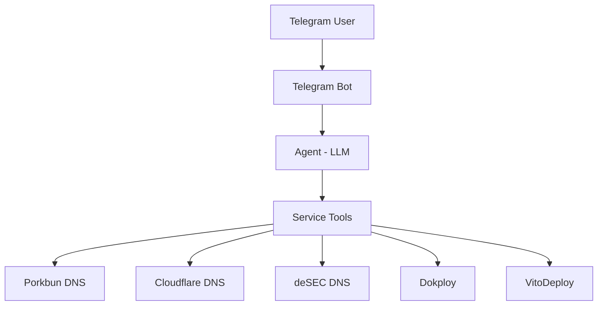

# Kerdus

A lightweight, single-user AI infrastructure assistant accessible through Telegram.

Manage DNS, deployments, and other services — all via natural language.

## Architecture



## Stack

- Python 3.12+
- FastAPI + uvicorn
- python-telegram-bot
- OpenAI-compatible LLM API
- httpx (HTTP client)
- loguru (logging)

## Prerequisites

- Python 3.12+
- [uv](https://docs.astral.sh/uv/) package manager
- A Telegram bot token (from @BotFather)
- An LLM API key (OpenAI-compatible)
- API credentials for the services you want to manage

## Setup

```bash
git clone https://github.com/yourname/kerdus.git
cd kerdus
cp .env.example .env
# edit .env with your secrets
uv sync
```

## Configuration

`config.json` (static):

```json
{
  "telegram": {
    "allowed_user_id": 123456789
  },
  "agent": {
    "max_iterations": 5
  },
  "porkbun": {
    "enabled": true
  }
}
```

Each service integration has an `enabled` toggle in `config.json`.

`.env` (secrets, never commit):

```
TELEGRAM_BOT_TOKEN=...
TELEGRAM_ALLOWED_USER_ID=...
LLM_API_KEY=...
LLM_MODEL=gpt-4o
LLM_BASE_URL=
PORKBUN_API_KEY=
PORKBUN_SECRET_KEY=
```

## Run

```bash
uv run uvicorn app.main:app --host 0.0.0.0 --port 8000
```

## Docker

```bash
docker build -t kerdus .
docker run -p 8000:8000 --env-file .env kerdus
```

Mount `config.json` to hot-edit from the host:

```bash
docker run -p 8000:8000 --env-file .env \
  -v $(pwd)/config.json:/app/config.json \
  kerdus
```

## Dynamic configuration

`config.json` is hot-reloaded two ways:

1. **Polling** — the config file is checked for changes every 5 seconds and
   applied if it changed.
2. **Manual trigger** — `POST /config/reload` reloads the file on demand.

Changes to `telegram.allowed_user_id`, `agent.max_iterations`, and
`porkbun.enabled` take effect immediately.

## Usage

Message your Telegram bot:

- "List my domains."
- "Show DNS records for example.com."
- "Add an A record for api.example.com pointing to 1.2.3.4."
- "Delete the CNAME record for www.example.com."

## Safety

The agent has **no** shell, SSH, filesystem, or arbitrary code execution capability.

All actions go through registered service tools with explicit schemas.

## Endpoints

- `GET /health` — liveness check
- `GET /ready` — readiness check
- `POST /config/reload` — force config reload
